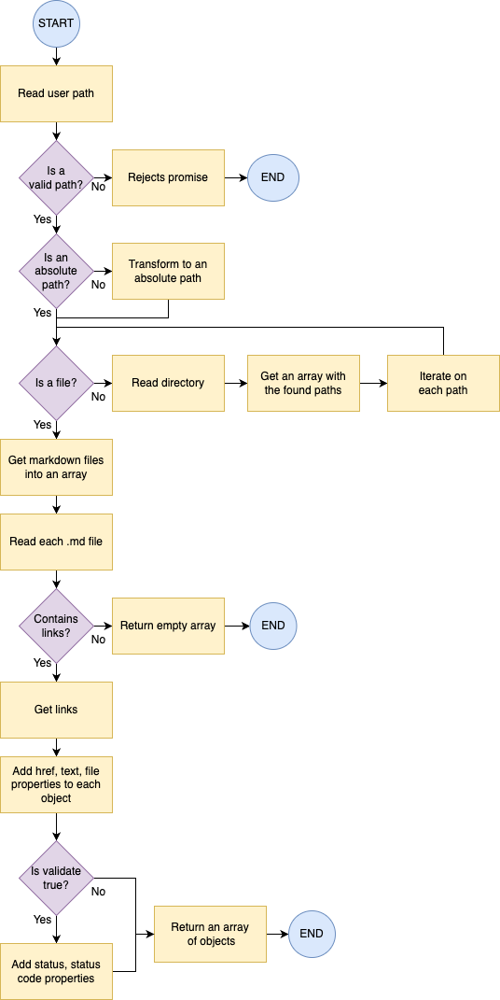
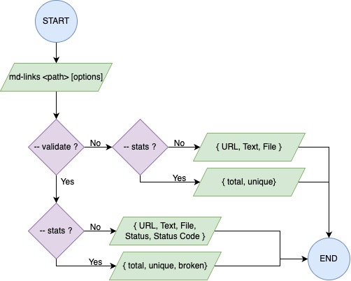

# Markdown Links

## Description

This is a project designed to locate and extract the links from markdown files given a path using [Node.js](https://nodejs.org/). It can also verify the status of every link by making a _fetch_ HTTP request.  
The project facilitates an API and a CLI tool.

## How to install

It can be installed by running the following in the terminal  
`npm install md-links-alim`

## How to use

This projects consists of two parts:

### 1. JavaScript API

The module can be imported into other Node.js scripts and offers the following interface:

`mdLinks(path, options)`

#### Arguments

- `path` : Absolute or relative path to a file or directory.
- `options` : An object with _only_ the following property:
  - `validate` : A boolean to determinate if the links found will be validated or not.

#### Return value

This function will return a promise resolving to an array of objects, where each object represents a link and has the following properties

With `validate:false` :

- `href` : URL found.
- `text` : Text within the link (`<a>`).
- `file` : Path of the file where the link was found.

With `validate:true` :

- `href` : URL found.
- `text` : Text within the link (`<a>`).
- `file` : Path of the file where the link was found.
- `status` : Code of the HTTP response.
- `ok` : Message indicating the status of the link.

#### Example (with results as comments)

```js
import { mdLinks } from "md-links-alim";

mdLinks("./some/example.md")
  .then((links) => {
    // => [{ href, text, file }, ...]
  })
  .catch(console.error);

mdLinks("./some/example.md", { validate: true })
  .then((links) => {
    // => [{ href, text, file, status, ok }, ...]
  })
  .catch(console.error);

mdLinks("./some/dir")
  .then((links) => {
    // => [{ href, text, file }, ...]
  })
  .catch(console.error);
```

### 2. CLI (Command Line Interface)

This app can be executed from the terminal as the following:
`md-links <path-to-file> [options]`

For example:

```sh
$ md-links-alim ./some/example.md
------------------------------
URL: http://something.com/2/3/
Text: Link to something
File: ./some/example.md
------------------------------
URL: https://something-else.net/algun-doc.html
Text: some doc
File: ./some/example.md
------------------------------
URL: http://google.com/
Text: Google
File: ./some/example.md
```

If the text of the link is longer than 50 characters, it will be cut short and add `...`.

#### Options

##### `--validate`

When using the option `--validate`, the module must make a HTTP request to find if the link works or not. If the link redirects to an URL that works it will be considered as ok.

For example:

```sh
$ md-links ./some/example.md --validate
------------------------------
URL: http://something.com/2/3/
Text: Link to something
File: ./some/example.md
Status: OK
Status Code: 200
------------------------------
URL: https://something-else.net/algun-doc.html
Text: some doc
File: ./some/example.md
Status: Not Found
Status Code: 404
------------------------------
URL: http://google.com/
Text: Google
File: ./some/example.md
Status: OK
Status Code: 200
```

##### `--stats`

When using the option `--stats`, the output will indicate the total of links found and how many are unique.

```sh
$ md-links ./some/example.md --stats
Total: 3
Unique: 3
```

The options `--validate` and `stats` can also be combined to obtain stats that require the HTTP validation.

```sh
$ md-links ./some/example.md --stats --validate
Total: 3
Unique: 3
Broken: 1
```

## Flowchart

For the JS API:  


For the CLI:  


## Author

Hi! My name is Ana Ibarra.  
You can find me on [LinkedIn](https://www.linkedin.com/in/anaibarram/)
